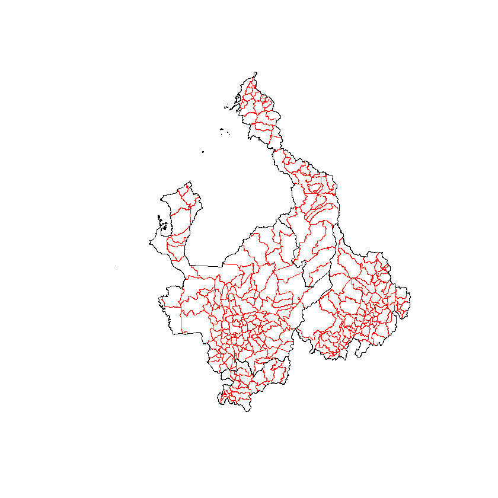
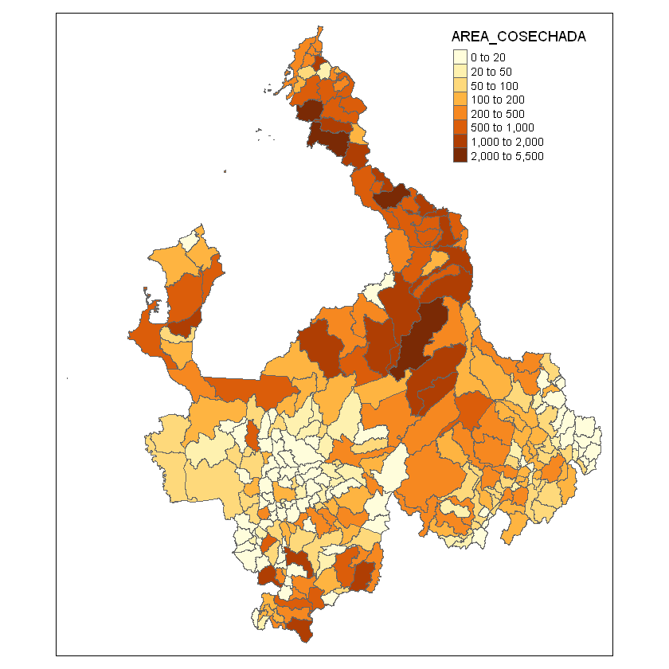
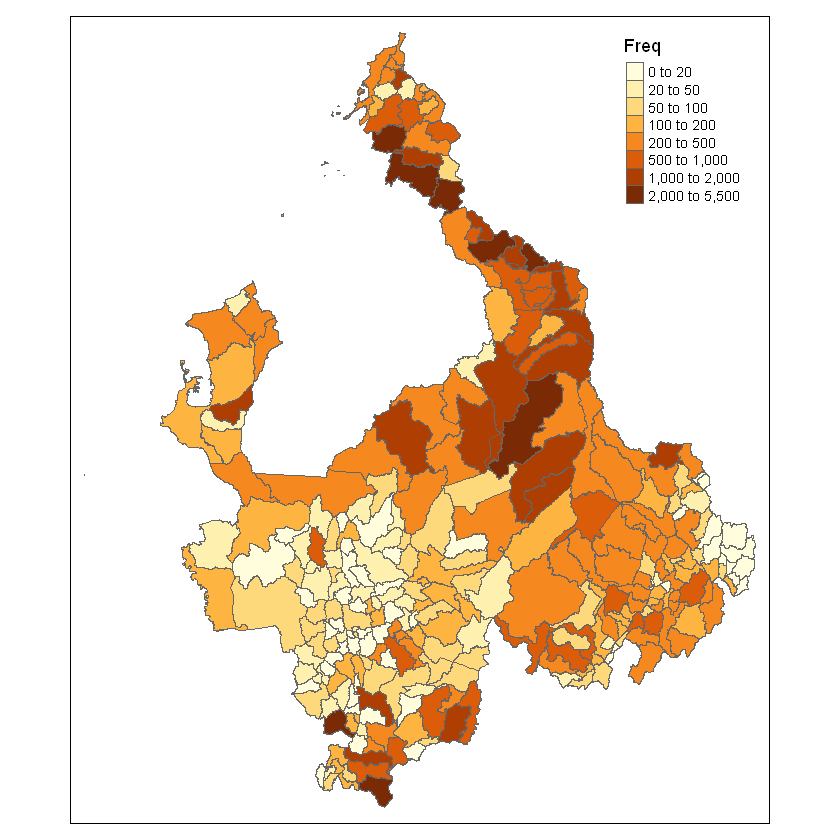
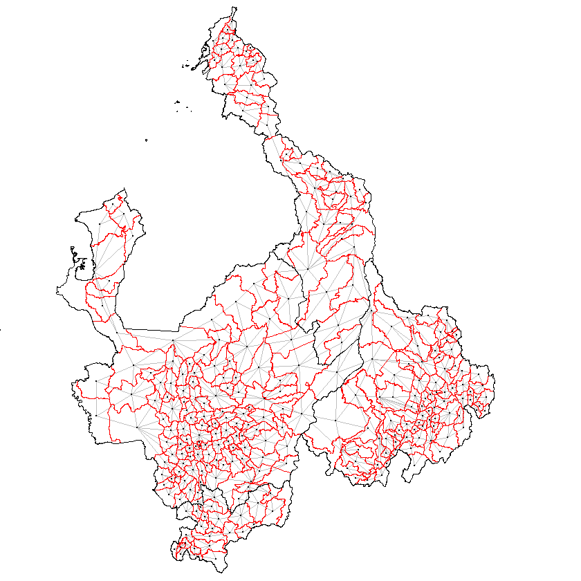
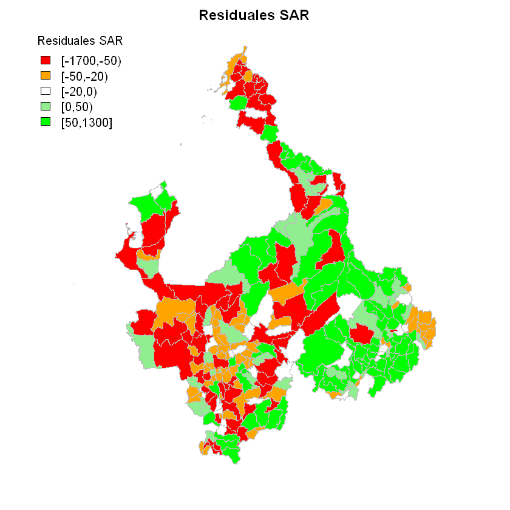

# Modelos Espaciales
## Regresión Espacial

La regresión espacial sirve para describir la relación entre variables entendidas como fenómenos espaciales. Los modelos de regresión espacial son varios. En la sesión se analizarón los más comunes.

Para efectos del ejercicio se volverá a hacer uso de los datos relacionados con el Censo Agropecuario y, de nuevo, el ejemplo se desarrollará con el cultivo de la yuca.

Se cargan, entonces, los datos asociados a los tipos de cultivo:


```R
load('Total_nacional(csv)/Cultivos.RData')
```

Al igual que en el ejercicio anterior, se puede revisar la estructura de los fragmentos de datos:


```R
str(Cultivos)
```

    'data.frame':	5335518 obs. of  23 variables:
     $ TIPO_REG      : int  4 4 4 4 4 4 4 4 4 4 ...
     $ PAIS          : int  170 170 170 170 170 170 170 170 170 170 ...
     $ P_DEPTO       : chr  "05" "05" "05" "05" ...
     $ P_MUNIC       : chr  "05001" "05001" "05001" "05001" ...
     $ UC_UO         : chr  "00010000" "00010000" "00010000" "00010000" ...
     $ ENCUESTA      : chr  "087000798" "087000798" "087000798" "087000798" ...
     $ COD_VEREDA    : chr  "05001999" "05001999" "05001999" "05001999" ...
     $ P_S6P45B      : int  1 1 1 1 1 1 2 3 3 3 ...
     $ P_S6P45A      : int  2 2 2 2 2 2 1 2 1 1 ...
     $ P_S6P46       : chr  "00112201001" "00112201001" "00151001001" "00151001001" ...
     $ P_S6P47A      : int  11 9 8 3 8 8 5 2 2 3 ...
     $ P_S6P47B      : int  2012 2013 2013 2013 2012 2013 2007 2013 2006 1997 ...
     $ P_S6P48       : int  2 2 2 2 2 2 1 2 2 2 ...
     $ P_S6P50       : int  2 2 2 2 2 2 1 2 1 1 ...
     $ P_S6P51_SP1   : int  NA NA NA NA NA NA NA NA NA NA ...
     $ P_S6P51_SP2   : int  1 1 1 1 1 1 1 1 1 1 ...
     $ P_S6P51_SP3   : int  NA NA NA NA NA NA NA NA NA NA ...
     $ P_S6P53       : int  NA NA NA NA NA NA NA NA 2 NA ...
     $ P_S6P57A      : num  3.13 0 0 15.29 14.26 ...
     $ P_S6P59_UNIF  : num  3.28 NA NA 16.02 14.95 ...
     $ P_S6P60       : int  12 12 12 12 12 12 12 12 12 12 ...
     $ AREA_SEMBRADA : num  0.954 0.954 0.954 0.954 0.954 ...
     $ AREA_COSECHADA: num  0.954 0 0 0.954 0.954 ...
     - attr(*, "spec")=List of 2
      ..$ cols   :List of 23
      .. ..$ TIPO_REG      : list()
      .. .. ..- attr(*, "class")= chr  "collector_integer" "collector"
      .. ..$ PAIS          : list()
      .. .. ..- attr(*, "class")= chr  "collector_integer" "collector"
      .. ..$ P_DEPTO       : list()
      .. .. ..- attr(*, "class")= chr  "collector_character" "collector"
      .. ..$ P_MUNIC       : list()
      .. .. ..- attr(*, "class")= chr  "collector_character" "collector"
      .. ..$ UC_UO         : list()
      .. .. ..- attr(*, "class")= chr  "collector_character" "collector"
      .. ..$ ENCUESTA      : list()
      .. .. ..- attr(*, "class")= chr  "collector_character" "collector"
      .. ..$ COD_VEREDA    : list()
      .. .. ..- attr(*, "class")= chr  "collector_character" "collector"
      .. ..$ P_S6P45B      : list()
      .. .. ..- attr(*, "class")= chr  "collector_integer" "collector"
      .. ..$ P_S6P45A      : list()
      .. .. ..- attr(*, "class")= chr  "collector_integer" "collector"
      .. ..$ P_S6P46       : list()
      .. .. ..- attr(*, "class")= chr  "collector_character" "collector"
      .. ..$ P_S6P47A      : list()
      .. .. ..- attr(*, "class")= chr  "collector_integer" "collector"
      .. ..$ P_S6P47B      : list()
      .. .. ..- attr(*, "class")= chr  "collector_integer" "collector"
      .. ..$ P_S6P48       : list()
      .. .. ..- attr(*, "class")= chr  "collector_integer" "collector"
      .. ..$ P_S6P50       : list()
      .. .. ..- attr(*, "class")= chr  "collector_integer" "collector"
      .. ..$ P_S6P51_SP1   : list()
      .. .. ..- attr(*, "class")= chr  "collector_integer" "collector"
      .. ..$ P_S6P51_SP2   : list()
      .. .. ..- attr(*, "class")= chr  "collector_integer" "collector"
      .. ..$ P_S6P51_SP3   : list()
      .. .. ..- attr(*, "class")= chr  "collector_integer" "collector"
      .. ..$ P_S6P53       : list()
      .. .. ..- attr(*, "class")= chr  "collector_integer" "collector"
      .. ..$ P_S6P57A      : list()
      .. .. ..- attr(*, "class")= chr  "collector_double" "collector"
      .. ..$ P_S6P59_UNIF  : list()
      .. .. ..- attr(*, "class")= chr  "collector_double" "collector"
      .. ..$ P_S6P60       : list()
      .. .. ..- attr(*, "class")= chr  "collector_integer" "collector"
      .. ..$ AREA_SEMBRADA : list()
      .. .. ..- attr(*, "class")= chr  "collector_double" "collector"
      .. ..$ AREA_COSECHADA: list()
      .. .. ..- attr(*, "class")= chr  "collector_double" "collector"
      ..$ default: list()
      .. ..- attr(*, "class")= chr  "collector_guess" "collector"
      ..- attr(*, "class")= chr "col_spec"
    

Y seleccionamos el cultivo (no hay que olvidar que, para facilidad de la selección, es recomendable transformar la variable `P_S6P46` que es una cadena de caracteres a una variable tipo factor) y luego se adecuán las variables que se requiren:


```R
Cultivos$P_S6P46<-factor(Cultivos$P_S6P46)
cultivo1<-Cultivos[Cultivos$P_S6P46=='00159201001',]
cultivo1$P_DEPTO<-factor(cultivo1$P_DEPTO)
cultivo1$P_MUNIC<-factor(cultivo1$P_MUNIC)
cultivo1$COD_VEREDA<-factor(cultivo1$COD_VEREDA)
```

Y, ahora, se libera memoria:


```R
rm(Cultivos)
```

Se requiere definir la forma de trabajar, el ejercicio anterior se desarrolló con patrones puntuales, en esta oportunidad se trabajará con datos de áreas y se hará la selección a nivel de municipios. De nuevo, se seleccionarán los datos de los departamentos de Antioquia `(05)`, Santander `(68)`, Bolívar `(13)` y Caldas `(17)`:


```R
cultivo1$COD_DPTO<-cultivo1$P_DEPTO; cultivo1$P_DEPTO<-NULL
cultivo.region<-cultivo1[cultivo1$COD_DPTO=='68' | 
                           cultivo1$COD_DPTO=='05' |
                           cultivo1$COD_DPTO=='17' |
                           cultivo1$COD_DPTO=='13',c(3,6,9,21,22,23)]
```

Entonces, las variables seleccionadas fueron:


```R
names(cultivo.region)
```


<ol class=list-inline>
	<li>'P_MUNIC'</li>
	<li>'COD_VEREDA'</li>
	<li>'P_S6P46'</li>
	<li>'AREA_SEMBRADA'</li>
	<li>'AREA_COSECHADA'</li>
	<li>'COD_DPTO'</li>
</ol>


Antes de organizar los datos, no sobra traer los mapas:


```R
library(rgdal)
```

    Loading required package: sp
    rgdal: version: 1.3-9, (SVN revision 794)
     Geospatial Data Abstraction Library extensions to R successfully loaded
     Loaded GDAL runtime: GDAL 2.2.3, released 2017/11/20
     Path to GDAL shared files: C:/Users/UIS/Documents/R/win-library/3.5/rgdal/gdal
     GDAL binary built with GEOS: TRUE 
     Loaded PROJ.4 runtime: Rel. 4.9.3, 15 August 2016, [PJ_VERSION: 493]
     Path to PROJ.4 shared files: C:/Users/UIS/Documents/R/win-library/3.5/rgdal/proj
     Linking to sp version: 1.3-1 
    

Primero los departamentos (por cuestiones estéticas en la representación):


```R
departamentos <- readOGR(dsn = 'Mapas', layer = 'DepartamentosVeredas')
depart.cultivo<-departamentos[departamentos$DPTO_CCDGO=='68'|
                                departamentos$DPTO_CCDGO=='05'|
                                departamentos$DPTO_CCDGO=='17'|
                                departamentos$DPTO_CCDGO=='13',]
```

    OGR data source with driver: ESRI Shapefile 
    Source: "D:\Dropbox\UIS\0000 SEMINARIO ESPACIAL\Bases\CENSO AGROPECUARIO\Total_nacional(csv)\Mapas", layer: "DepartamentosVeredas"
    with 33 features
    It has 1 fields
    

    Warning message in readOGR(dsn = "Mapas", layer = "DepartamentosVeredas"):
    "Z-dimension discarded"

Y, luego, los municipios:


```R
municipios <- readOGR(dsn = 'Mapas', layer = 'MunicipiosVeredas')
munic.cultivo<-municipios[municipios$DPTO_CCDGO=='68'|
                            municipios$DPTO_CCDGO=='05'|
                            municipios$DPTO_CCDGO=='17'|
                            municipios$DPTO_CCDGO=='13',]
```

    OGR data source with driver: ESRI Shapefile 
    Source: "D:\Dropbox\UIS\0000 SEMINARIO ESPACIAL\Bases\CENSO AGROPECUARIO\Total_nacional(csv)\Mapas", layer: "MunicipiosVeredas"
    with 1121 features
    It has 5 fields
    

    Warning message in readOGR(dsn = "Mapas", layer = "MunicipiosVeredas"):
    "Z-dimension discarded"

Con lo que se tiene el siguiente mapa:


```R
plot(munic.cultivo, border = 'red')
plot(depart.cultivo, border = 'black', add = T)
```





La regresión se va a trabajar a nivel de municipio, el mapa respectivo ya contiene fragmentos de datos que pueden aprovecharse:


```R
summary(munic.cultivo)
```


    Object of class SpatialPolygonsDataFrame
    Coordinates:
             min       max
    x -77.734376 -72.47740
    y   4.799679  10.80319
    Is projected: FALSE 
    proj4string :
    [+proj=longlat +datum=WGS84 +no_defs +ellps=WGS84 +towgs84=0,0,0]
    Data attributes:
        DPTOMPIO     DPTO_CCDGO    MPIO_CCDGO        MPIO_CNMBR    MPIO_CCNCT 
     05001  :  1   05     :125   001    :  4   BARBOSA    :  2   05001  :  1  
     05002  :  1   68     : 87   042    :  3   BETULIA    :  2   05002  :  1  
     05004  :  1   13     : 46   873    :  3   CONCEPCIÓN:  2   05004  :  1  
     05021  :  1   17     : 27   013    :  2   EL PEÑÓN :  2   05021  :  1  
     05030  :  1   08     :  0   030    :  2   GUADALUPE  :  2   05030  :  1  
     05031  :  1   11     :  0   051    :  2   RIONEGRO   :  2   05031  :  1  
     (Other):279   (Other):  0   (Other):269   (Other)    :273   (Other):279  


El ejercicio se va a definir como la cantidad de unidades productoras existentes en un minicipio explicadas en función del área cosechada, por lo tanto, se requiere construir los respectivos `data frames`:


```R
tabla<-with(cultivo.region, as.data.frame(table(P_MUNIC,P_S6P46)))
areas1<-tabla[tabla$Freq!=0,]
head(areas1)
```


<table>
<thead><tr><th></th><th scope=col>P_MUNIC</th><th scope=col>P_S6P46</th><th scope=col>Freq</th></tr></thead>
<tbody>
	<tr><th scope=row>165999</th><td>05001      </td><td>00159201001</td><td> 84        </td></tr>
	<tr><th scope=row>166000</th><td>05002      </td><td>00159201001</td><td> 58        </td></tr>
	<tr><th scope=row>166001</th><td>05004      </td><td>00159201001</td><td> 54        </td></tr>
	<tr><th scope=row>166002</th><td>05021      </td><td>00159201001</td><td>123        </td></tr>
	<tr><th scope=row>166003</th><td>05030      </td><td>00159201001</td><td> 17        </td></tr>
	<tr><th scope=row>166004</th><td>05031      </td><td>00159201001</td><td> 67        </td></tr>
</tbody>
</table>


```R
areas2<-aggregate(AREA_COSECHADA~P_MUNIC, FUN = sum, data = cultivo.region)
head(areas2)
```


<table>
<thead><tr><th scope=col>P_MUNIC</th><th scope=col>AREA_COSECHADA</th></tr></thead>
<tbody>
	<tr><td>05001     </td><td>188.097503</td></tr>
	<tr><td>05002     </td><td> 94.892446</td></tr>
	<tr><td>05004     </td><td> 88.014186</td></tr>
	<tr><td>05021     </td><td> 22.789051</td></tr>
	<tr><td>05030     </td><td>  6.984565</td></tr>
	<tr><td>05031     </td><td> 43.525300</td></tr>
</tbody>
</table>


Y, ahora, se crea un nuevo `data frame` con la información unificada:


```R
df.cultivo<-merge(areas1,areas2, by = 'P_MUNIC')
head(df.cultivo)
```


<table>
<thead><tr><th scope=col>P_MUNIC</th><th scope=col>P_S6P46</th><th scope=col>Freq</th><th scope=col>AREA_COSECHADA</th></tr></thead>
<tbody>
	<tr><td>05001      </td><td>00159201001</td><td> 84        </td><td>188.097503 </td></tr>
	<tr><td>05002      </td><td>00159201001</td><td> 58        </td><td> 94.892446 </td></tr>
	<tr><td>05004      </td><td>00159201001</td><td> 54        </td><td> 88.014186 </td></tr>
	<tr><td>05021      </td><td>00159201001</td><td>123        </td><td> 22.789051 </td></tr>
	<tr><td>05030      </td><td>00159201001</td><td> 17        </td><td>  6.984565 </td></tr>
	<tr><td>05031      </td><td>00159201001</td><td> 67        </td><td> 43.525300 </td></tr>
</tbody>
</table>


Y, ahora, se anexa ese `data frame` a los datos del mapa a trabajar (antes, hay que cambiar el nombre de la variable que representa el código del municipio):


```R
df.cultivo$DPTOMPIO<-df.cultivo$P_MUNIC; df.cultivo$P_Munic<-NULL
```


```R
library(dplyr)
```

    Warning message:
    "package 'dplyr' was built under R version 3.5.3"
    Attaching package: 'dplyr'
    
    The following objects are masked from 'package:stats':
    
        filter, lag
    
    The following objects are masked from 'package:base':
    
        intersect, setdiff, setequal, union
    
    


```R
munic.cultivo@data <- left_join(munic.cultivo@data, df.cultivo)
```

    Joining, by = "DPTOMPIO"
    Warning message:
    "Column `DPTOMPIO` joining factors with different levels, coercing to character vector"


```R
summary(munic.cultivo@data)
```


       DPTOMPIO           DPTO_CCDGO    MPIO_CCDGO        MPIO_CNMBR    MPIO_CCNCT 
     Length:285         05     :125   001    :  4   BARBOSA    :  2   05001  :  1  
     Class :character   68     : 87   042    :  3   BETULIA    :  2   05002  :  1  
     Mode  :character   13     : 46   873    :  3   CONCEPCIÓN:  2   05004  :  1  
                        17     : 27   013    :  2   EL PEÑÓN :  2   05021  :  1  
                        08     :  0   030    :  2   GUADALUPE  :  2   05030  :  1  
                        11     :  0   051    :  2   RIONEGRO   :  2   05031  :  1  
                        (Other):  0   (Other):269   (Other)    :273   (Other):279  
        P_MUNIC           P_S6P46         Freq        AREA_COSECHADA    
     05001  :  1   00159201001:281   Min.   :   1.0   Min.   :   0.059  
     05002  :  1   00111201001:  0   1st Qu.:  36.0   1st Qu.:  18.416  
     05004  :  1   00112201001:  0   Median : 129.0   Median :  93.182  
     05021  :  1   00112201002:  0   Mean   : 356.6   Mean   : 292.750  
     05030  :  1   00113202001:  0   3rd Qu.: 339.0   3rd Qu.: 276.870  
     (Other):276   (Other)    :  0   Max.   :5028.0   Max.   :5314.928  
     NA's   :  4   NA's       :  4   NA's   :4        NA's   :4         


Para efectos del ejercicio, se transformarán los datos perdidos en valores `0`:


```R
munic.cultivo$Freq[is.na(munic.cultivo$Freq)] <- 0
munic.cultivo$AREA_COSECHADA[is.na(munic.cultivo$AREA_COSECHADA)] <- 0
summary(munic.cultivo)
```


    Object of class SpatialPolygonsDataFrame
    Coordinates:
             min       max
    x -77.734376 -72.47740
    y   4.799679  10.80319
    Is projected: FALSE 
    proj4string :
    [+proj=longlat +datum=WGS84 +no_defs +ellps=WGS84 +towgs84=0,0,0]
    Data attributes:
       DPTOMPIO           DPTO_CCDGO    MPIO_CCDGO        MPIO_CNMBR    MPIO_CCNCT 
     Length:285         05     :125   001    :  4   BARBOSA    :  2   05001  :  1  
     Class :character   68     : 87   042    :  3   BETULIA    :  2   05002  :  1  
     Mode  :character   13     : 46   873    :  3   CONCEPCIÓN:  2   05004  :  1  
                        17     : 27   013    :  2   EL PEÑÓN :  2   05021  :  1  
                        08     :  0   030    :  2   GUADALUPE  :  2   05030  :  1  
                        11     :  0   051    :  2   RIONEGRO   :  2   05031  :  1  
                        (Other):  0   (Other):269   (Other)    :273   (Other):279  
        P_MUNIC           P_S6P46         Freq        AREA_COSECHADA   
     05001  :  1   00159201001:281   Min.   :   0.0   Min.   :   0.00  
     05002  :  1   00111201001:  0   1st Qu.:  34.0   1st Qu.:  17.41  
     05004  :  1   00112201001:  0   Median : 116.0   Median :  88.73  
     05021  :  1   00112201002:  0   Mean   : 351.6   Mean   : 288.64  
     05030  :  1   00113202001:  0   3rd Qu.: 338.0   3rd Qu.: 275.64  
     (Other):276   (Other)    :  0   Max.   :5028.0   Max.   :5314.93  
     NA's   :  4   NA's       :  4                                     


Ahora, un mapa que nunca sobra:


```R
library(tmap)
```

    Warning message:
    "package 'tmap' was built under R version 3.5.3"


```R
qtm(munic.cultivo,"AREA_COSECHADA", fill.breaks = c(0,20,50,100,200,500,1000,2000,5500))
```

    Linking to GEOS 3.6.1, GDAL 2.2.3, PROJ 4.9.3
    





```R
qtm(munic.cultivo,"Freq", fill.breaks = c(0,20,50,100,200,500,1000,2000,5500))
```





Ahora, se construye la matriz de pesos espaciales:


```R
library(spdep) 
```

    Loading required package: Matrix
    Loading required package: spData
    To access larger datasets in this package, install the spDataLarge
    package with: `install.packages('spDataLarge',
    repos='https://nowosad.github.io/drat/', type='source')`
    


```R
map_crd <- coordinates(munic.cultivo)
W_cont_el <- poly2nb(munic.cultivo, queen=T)
W_cont_el_mat <- nb2listw(W_cont_el, style="W", zero.policy=TRUE)
```

Con lo que se tiene las conecciones


```R
par(mar=rep(0,4))
plot(W_cont_el_mat,coords=map_crd,pch=19, cex=0.1, col="gray")
plot(munic.cultivo, border = 'red', add = T)
plot(depart.cultivo, border = 'black', add = T)
```





Se evalúa la autocorrelación espacial:


```R
moran.test(munic.cultivo$Freq, listw=W_cont_el_mat, zero.policy=T)
```


    
    	Moran I test under randomisation
    
    data:  munic.cultivo$Freq  
    weights: W_cont_el_mat    
    
    Moran I statistic standard deviate = 9.4404, p-value < 2.2e-16
    alternative hypothesis: greater
    sample estimates:
    Moran I statistic       Expectation          Variance 
          0.338187724      -0.003521127       0.001310176 
    


Ya se tienen, entonces, los elementos para los modelos de regresión:

### Modelo Lineal

Como se ha discutido, el modelo base para los modelos de regresión espacial es un modelo de regresión generalizado. Por lo tanto, se va a probar, primero, el modelo de mínimos cuadrados ordinadios (OLS):


```R
mod.lm <- lm(Freq ~ AREA_COSECHADA, data=munic.cultivo)
summary(mod.lm)
```


    
    Call:
    lm(formula = Freq ~ AREA_COSECHADA, data = munic.cultivo)
    
    Residuals:
         Min       1Q   Median       3Q      Max 
    -1649.21   -52.78   -18.95    46.90  1296.89 
    
    Coefficients:
                   Estimate Std. Error t value Pr(>|t|)    
    (Intercept)    29.39038   14.53654   2.022   0.0441 *  
    AREA_COSECHADA  1.11644    0.02284  48.871   <2e-16 ***
    ---
    Signif. codes:  0 '***' 0.001 '**' 0.01 '*' 0.05 '.' 0.1 ' ' 1
    
    Residual standard error: 218.7 on 283 degrees of freedom
    Multiple R-squared:  0.8941,	Adjusted R-squared:  0.8937 
    F-statistic:  2388 on 1 and 283 DF,  p-value: < 2.2e-16
    


Como se observa, el modelo se ajusta bien, el $R^2$ es alto y puede significar que existe una relación espuria (es entendible dadas las variables seleccionadas pero, para efectos del ejercicio, se va a continuar con el modelo)

Ahora, se puede construir una gráfica de los residuales para analizar si, en estos, queda algún componente espacial:


```R
res <- mod.lm$residuals
summary(res)
```


        Min.  1st Qu.   Median     Mean  3rd Qu.     Max. 
    -1649.21   -52.78   -18.95     0.00    46.90  1296.89 


```R
library(classInt) # Para construir los intervalos de clase y clasificar con colores
```


```R
res.palette <- colorRampPalette(c("red","orange","white", "lightgreen","green"), space = "rgb") # Se crea la paleta de colores
pal <- res.palette(5) 

classes_fx <- classIntervals(res, n=5, style="fixed", fixedBreaks=c(-1650,-50,-20,0,50,1300), rtimes = 1) # Se ajustan los intervalos de clase
cols <- findColours(classes_fx,pal)
```

Ahora el gráfico:


```R
par(mar=rep(2,4))
plot(munic.cultivo,col=cols, main="Residuales OLS", border="grey")
legend(x="topleft",cex=1,fill=attr(cols,"palette"),bty="n",legend=names(attr(cols, "table")),title="Residuales OLS",ncol=1)
```


Ahora, se revisa si los residuales presentan autocorrelación espacial (Test de Morán):


```R
moran.test(res, listw=W_cont_el_mat, zero.policy=T)
```


    
    	Moran I test under randomisation
    
    data:  res  
    weights: W_cont_el_mat    
    
    Moran I statistic standard deviate = 0.085809, p-value = 0.4658
    alternative hypothesis: greater
    sample estimates:
    Moran I statistic       Expectation          Variance 
        -0.0004227129     -0.0035211268      0.0013038208 
    


### Modelo SAR

El primer modelo a evaluar es el Modelo Espacial Autorregresivo (SAR por su nombre en inglés) donde se evalúa el componente espacial sólo como parte de la variable $y$:
$$
y = \rho W y + X \beta + \epsilon
$$


```R
mod.sar <- lagsarlm(Freq ~ AREA_COSECHADA, data = munic.cultivo, listw=W_cont_el_mat, zero.policy=T, tol.solve=1e-12)
summary(mod.sar)
```


    
    Call:lagsarlm(formula = Freq ~ AREA_COSECHADA, data = munic.cultivo, 
        listw = W_cont_el_mat, zero.policy = T, tol.solve = 1e-12)
    
    Residuals:
          Min        1Q    Median        3Q       Max 
    -1657.919   -50.262   -20.230    55.643  1280.566 
    
    Type: lag 
    Coefficients: (asymptotic standard errors) 
                    Estimate Std. Error z value Pr(>|z|)
    (Intercept)    35.933173  16.569634  2.1686  0.03011
    AREA_COSECHADA  1.128567   0.027099 41.6457  < 2e-16
    
    Rho: -0.028005, LR test value: 0.64218, p-value: 0.42292
    Asymptotic standard error: 0.033809
        z-value: -0.82832, p-value: 0.40749
    Wald statistic: 0.68611, p-value: 0.40749
    
    Log likelihood: -1938.575 for lag model
    ML residual variance (sigma squared): 47383, (sigma: 217.68)
    Number of observations: 285 
    Number of parameters estimated: 4 
    AIC: 3885.1, (AIC for lm: 3883.8)
    LM test for residual autocorrelation
    test value: 0.053149, p-value: 0.81767
    


Nótense lo siguiente $\rho = -0.028005 (0.42292)$; esto significa que la autocorrelación espacial es inexistente en la variaable dependiente.

Se continúa con la evaluación de los residuales:


```R
res.sar <- mod.sar$residuals
```


```R
classes_fx.sar <- classIntervals(res.sar, n=5, style="fixed", fixedBreaks=c(-1700,-50,-20,0,50,1300), rtimes = 1)
cols.sar <- findColours(classes_fx.sar,pal)
```


```R
par(mar=rep(2,4))
plot(munic.cultivo,col=cols.sar, main="Residuales SAR", border="grey")
legend(x="topleft",cex=1,fill=attr(cols,"palette"),bty="n",legend=names(attr(cols.sar, "table")),title="Residuales SAR",ncol=1)
```





```R
moran.test(res.sar, listw=W_cont_el_mat, zero.policy=T)
```


    
    	Moran I test under randomisation
    
    data:  res.sar  
    weights: W_cont_el_mat    
    
    Moran I statistic standard deviate = 0.32262, p-value = 0.3735
    alternative hypothesis: greater
    sample estimates:
    Moran I statistic       Expectation          Variance 
          0.008126892      -0.003521127       0.001303545 
    


Hasta el momento, el modelo de regresión espacial seleccionado no sirve para describir el fenómeno. Entonces, se puede probar con otro modelo.

### Modelo SEM

El Modelo Espacial del Error (SEM por sus nombre en inglés) sirve para evaluar si el proceso espacial se traslada al error mediante la forma:

$$
y = X \beta + (I_{n} - \lambda W )^{-1} \epsilon
$$


```R
mod.sem <- errorsarlm(Freq ~ AREA_COSECHADA, data = munic.cultivo, listw=W_cont_el_mat, zero.policy=T, tol.solve=1e-15)
summary(mod.sem)
```


    
    Call:errorsarlm(formula = Freq ~ AREA_COSECHADA, data = munic.cultivo, 
        listw = W_cont_el_mat, zero.policy = T, tol.solve = 1e-15)
    
    Residuals:
          Min        1Q    Median        3Q       Max 
    -1648.783   -52.682   -18.865    46.817  1296.913 
    
    Type: error 
    Coefficients: (asymptotic standard errors) 
                    Estimate Std. Error z value Pr(>|z|)
    (Intercept)    29.390857  14.474071  2.0306   0.0423
    AREA_COSECHADA  1.116422   0.022756 49.0606   <2e-16
    
    Lambda: -0.00090505, LR test value: 0.00010903, p-value: 0.99167
    Asymptotic standard error: 0.092849
        z-value: -0.0097475, p-value: 0.99222
    Wald statistic: 9.5014e-05, p-value: 0.99222
    
    Log likelihood: -1938.896 for error model
    ML residual variance (sigma squared): 47496, (sigma: 217.94)
    Number of observations: 285 
    Number of parameters estimated: 4 
    AIC: 3885.8, (AIC for lm: 3883.8)
    


Como debía suponerse $\lambda = -0.00090505 (0.99167)$ ya que en el modelo OLS los residuales no mostraron componente espacial. Aquí se va a obviar el análisis de los residuales pues carece de sentido hacerlo

### Modelo Espacial de Durbin

El modelo Espacial de Durbin (SDM) es otro modelo que se puede probar. Su forma es:

$$
y = \lambda Wy + X(\beta + \gamma) + XW(-\lambda\beta) + v
$$

Como se observa, incluye componente espacial en la variable dependiente y en las covariables:


```R
mod.sdm <- lagsarlm(Freq ~ AREA_COSECHADA, data = munic.cultivo, listw=W_cont_el_mat, zero.policy=T, type="mixed", tol.solve=1e-12)
summary(mod.sdm)
```


    
    Call:lagsarlm(formula = Freq ~ AREA_COSECHADA, data = munic.cultivo, 
        listw = W_cont_el_mat, type = "mixed", zero.policy = T, tol.solve = 1e-12)
    
    Residuals:
          Min        1Q    Median        3Q       Max 
    -1666.653   -52.247   -19.632    56.096  1279.031 
    
    Type: mixed 
    Coefficients: (asymptotic standard errors) 
                        Estimate Std. Error z value Pr(>|z|)
    (Intercept)        35.910975  16.576379  2.1664  0.03028
    AREA_COSECHADA      1.129740   0.027819 40.6104  < 2e-16
    lag.AREA_COSECHADA -0.021808   0.110620 -0.1971  0.84371
    
    Rho: -0.010621, LR test value: 0.014821, p-value: 0.9031
    Asymptotic standard error: 0.093109
        z-value: -0.11407, p-value: 0.90918
    Wald statistic: 0.013013, p-value: 0.90918
    
    Log likelihood: -1938.551 for mixed model
    ML residual variance (sigma squared): 47381, (sigma: 217.67)
    Number of observations: 285 
    Number of parameters estimated: 5 
    AIC: 3887.1, (AIC for lm: 3885.1)
    LM test for residual autocorrelation
    test value: 3.4705, p-value: 0.062472
    


Se observa: $\rho = -0.010621 (0.9031)$ y $\theta = -0.021808 (0.84371)$ lo que implica que no hay componente espacial en la interdependencia (esto se debe a la relación espuria que se describió enteriormente). El análisis de los residuales no se hará por motivos prácticos
